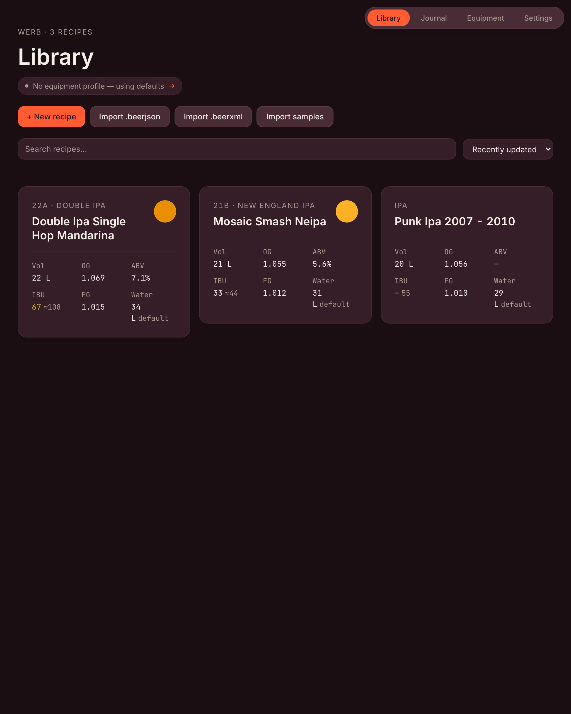
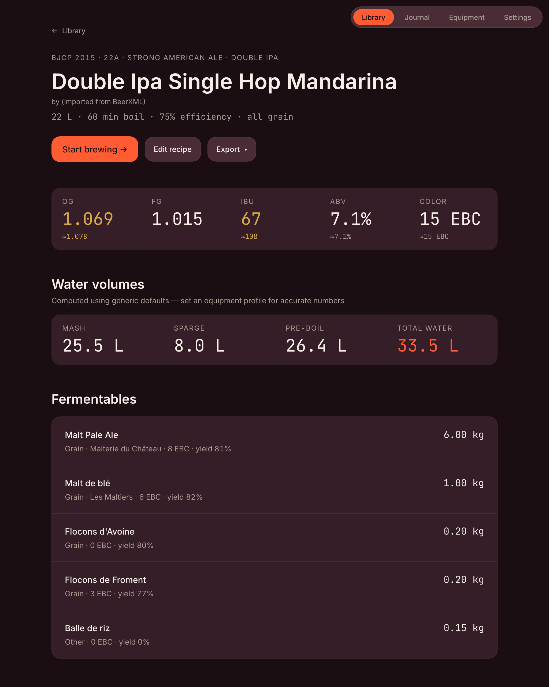
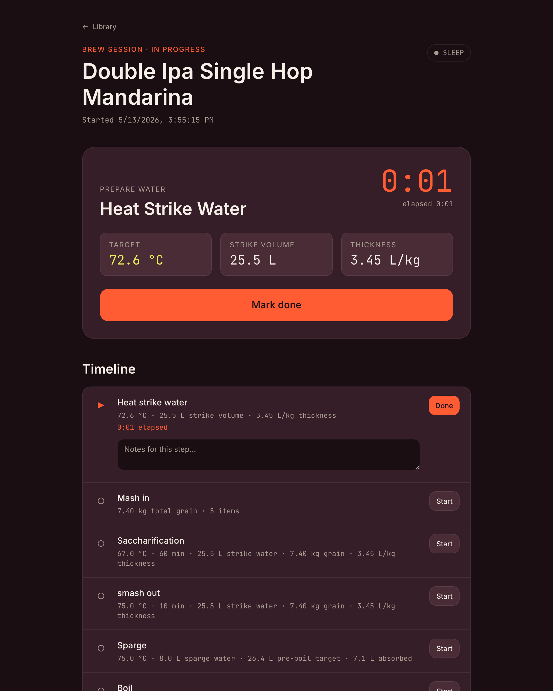
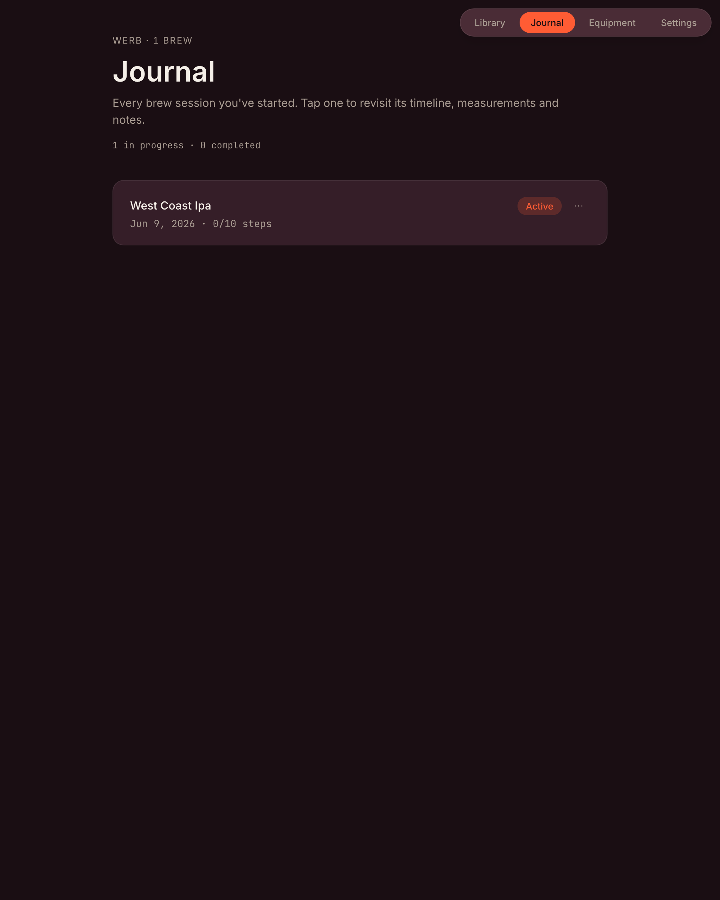

# Werb

**File-driven homebrewing tool.** Recipes in, brew sessions out — everything as plain JSON you can read, version, share, and round-trip with the tools you already use.

Werb sits at the intersection of [BeerSmith](https://beersmith.com/) (calculation depth) and [Docusaurus](https://docusaurus.io/) (file-first, your data is yours). One recipe is one BeerJSON file. One brew is one session file. Every calculation has a JSON Schema.

Runs as a [Tauri](https://tauri.app/) desktop app on macOS / Windows / Linux, and as a Progressive Web App in any modern browser.

| | |
|-|-|
|  |  |
| Library — every recipe at a glance. | Recipe — targets, water, hops, tasting profile. |
|  |  |
| Brew — live timeline, hop schedule, measurements. | Journal — every past brew, exportable. |

## Why

Most brewing apps lock your recipes inside a proprietary cloud silo. Werb takes the opposite stance: your recipes are plain BeerJSON files on your disk, your brew sessions are plain JSON next to them, and the calc engine is a typed open library you can audit. If Werb disappears tomorrow, your data is still BeerJSON — readable in every other brewing tool.

## What you can do

- **Import** BeerJSON and BeerXML recipes from BeerSmith, Brewfather, etc.
- **Compute** IBU (Tinseth), color (Morey), gravity, ABV, water volumes, mash strike temperature, carbonation (priming + force), yeast pitch rate, and brewing-salt additions to a target water profile.
- **Scale** a recipe to your equipment profile in one click.
- **Brew** with a live session screen: timeline with countdowns, per-hop addition reminders, measurement logging (gravity, pH, temperature, volume, ABV), screen wake-lock.
- **Reflect** with a post-brew sensory tasting form (7-axis radar chart, star rating, lessons-learned tags) that surfaces on the recipe screen so the next brew of the same recipe sees what to adjust.
- **Track** rough batch cost from a bundled price table with a single inflation coefficient for your local market.
- **Export** as BeerJSON, BeerXML, or a printable HTML (foldable into a PDF).
- **Sync** across devices via a private GitHub repo (optional, manual push/pull, your PAT never leaves the machine).

Everything works offline. Web build is a full PWA — installable to your home screen on phones and tablets.

## Quick start

Requirements: Node.js 20+, [pnpm](https://pnpm.io/), Rust toolchain (for the BeerXML WASM crate), and for desktop builds also a Tauri toolchain (see [Tauri prerequisites](https://tauri.app/v2/guides/getting-started/prerequisites/)).

```bash
pnpm install
pnpm gen:types   # generate TS types from JSON Schemas
pnpm test        # 251+ tests across calc / adapters / desktop hooks

# Web dev:
pnpm -F @werb/desktop dev

# Desktop dev (Tauri):
pnpm -F @werb/desktop tauri:dev

# Production web build:
pnpm -F @werb/desktop build
```

## Architecture

```
schemas/                       JSON Schemas — single source of truth
  ├─ werb-equipment.schema.json
  ├─ werb-session.schema.json
  └─ tools/*.input.schema.json   one per calc tool

packages/
  ├─ types/                    schemas → TypeScript types (generated)
  ├─ calc/                     pure calc engine (IBU, water, gravity, …)
  ├─ adapters/                 BeerJSON ⇄ internal, unit helpers
  └─ validate/                 Ajv-based schema validation

crates/
  ├─ werb-beerxml/             Rust BeerXML parser
  └─ werb-beerxml-wasm/        WASM bindings for the browser

apps/
  └─ desktop/                  React + Tauri shell
      ├─ src/screens/          Library, Recipe, Brew, Journal, Settings, Equipment, Editor
      ├─ src/data/             Storage backends, units, recipes, cost, prices
      └─ src-tauri/            Rust shell + capabilities

scripts/
  └─ gen-types.mjs             schema → .d.ts compiler
```

Every calc tool is contract-first: define the JSON Schema, regenerate types, implement, test. The UI consumes those generated types.

## Data & privacy

- **Everything stays on your device by default.** Web build uses [OPFS](https://developer.mozilla.org/en-US/docs/Web/API/File_System_API/Origin_private_file_system); desktop build writes to the platform's app-data directory.
- **GitHub sync is opt-in.** Your Personal Access Token is stored in your browser's local storage and never leaves the device. Push / Pull is manual and explicit.
- **No telemetry, no analytics, no third-party scripts.**

## Status

v0.1 — public alpha. The brewing math is well-tested and matches reference tables; UI is responsive (tablet-first, phone-usable). Cost estimator uses approximate EUR baseline prices — calibrate via Settings → Cost adjustment.

Tested against an iPad Air 2 (iOS 15.8.4) for the PWA path including the older Safari file-picker quirks.

## Standards & references

- **[BeerJSON 2.x](https://www.beerjson.com/)** — recipe interchange format. Werb reads and writes it round-trip.
- **[BeerXML 1.0](http://www.beerxml.com/)** — legacy interchange format. Read-only support via the bundled WASM parser.
- **[BJCP 2021 Style Guidelines](https://www.bjcp.org/style/2021/)** — embedded as the editor's style picker.

## License

MIT — see [LICENSE](./LICENSE).

## Contributing

Issues and PRs welcome. The contract-first workflow makes contributions easy to scope:

1. Pick or open an issue.
2. If your change touches a calculation, write the JSON Schema first.
3. Regenerate types (`pnpm gen:types`).
4. Implement + add tests.
5. `pnpm lint && pnpm typecheck && pnpm test && pnpm build` should stay green.

Before tagging a release, walk through [docs/SMOKE_TEST.md](./docs/SMOKE_TEST.md) on a clean profile.
